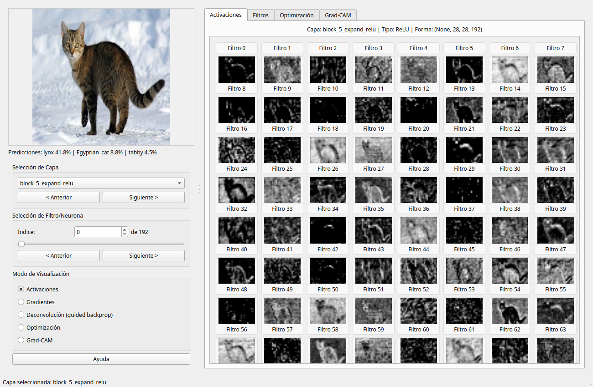

# TensorFlow Feature Visualization Toolbox

Una herramienta interactiva para visualizar y entender redes neuronales convolucionales implementadas en TensorFlow/Keras.

[](https://github.com/Sastiazaran/DeepVisualizationToolbox/actions/workflows/ci.yml)

## Características

- **Visualización en tiempo real**: observa las activaciones de la red mientras procesa imágenes de una webcam, un directorio o un dataset.
- **Cinco modos de visualización**: activaciones, mapas de saliencia, retropropagación guiada, optimización por ascenso de gradiente y Grad-CAM.
- **Predicciones en vivo**: las tres clases más probables de ImageNet se muestran junto a la imagen de entrada.
- **Interfaz intuitiva**: navegación entre capas y filtros con teclado o ratón, y guardado de la vista actual con una tecla.
- **Diez modelos pre-entrenados**: VGG16/19, ResNet50, ResNet50V2, InceptionV3, MobileNet, MobileNetV2, EfficientNetB0, EfficientNetV2B0 y ConvNeXtTiny.
- **Modelos propios**: cualquier modelo de Keras funciona, ya sea cargándolo con `--model-file` o usando `ModelWrapper` desde Python.

## Capturas de pantalla



*La interfaz muestra la imagen de entrada y sus predicciones (izquierda) junto a las activaciones de la capa seleccionada (derecha).*

## Instalación

### Requisitos

- Python 3.10 o superior
- TensorFlow 2.16 o superior (incluye Keras 3)
- PyQt6

### Instalación

```bash
git clone https://github.com/Sastiazaran/DeepVisualizationToolbox.git
cd DeepVisualizationToolbox

python -m venv .venv
source .venv/bin/activate      # en Windows: .venv\Scripts\activate

pip install -e .
```

Para trabajar sobre el código, instala también las herramientas de desarrollo:

```bash
pip install -e ".[dev]"
```

En Linux, PyQt6 necesita algunas bibliotecas del sistema:

```bash
sudo apt-get install libegl1 libgl1 libxkbcommon-x11-0 libdbus-1-3 libxcb-cursor0
```

## Uso

### Ejecutar la aplicación

```bash
# Configuración predeterminada (webcam + VGG16)
tf-feature-vis

# Equivalente, sin instalar el paquete
python run_toolbox.py
```

Si no hay ninguna cámara disponible, la aplicación se degrada automáticamente a una fuente de imágenes sintéticas en lugar de fallar.

### Ejemplos

```bash
# Ver los modelos disponibles
tf-feature-vis --list-models

# Explorar un directorio de imágenes con ResNet50
tf-feature-vis --model resnet50 --input-source directory:./mis_imagenes

# Una sola imagen con InceptionV3 (usa automáticamente su entrada de 299x299)
tf-feature-vis --model inception_v3 --input-source file:./gato.jpg

# Un dataset de Keras, en GPU
tf-feature-vis --model mobilenet_v2 --input-source dataset:cifar10 --gpu

# Un modelo propio guardado en disco
tf-feature-vis --model-file ./mi_modelo.keras --input-source synthetic
```

### Argumentos

| Argumento | Descripción |
| --- | --- |
| `--model` | Modelo del registro (por defecto `vgg16`) |
| `--model-file` | Ruta a un modelo guardado (`.keras`, `.h5` o SavedModel) |
| `--weights` | `imagenet`, `none` o una ruta a pesos |
| `--no-top` | Excluir las capas de clasificación |
| `--input-source` | `webcam[:id]`, `file:<ruta>`, `directory:<ruta>`, `dataset:<cifar10\|mnist>` o `synthetic` |
| `--input-size` | Tamaño `ANCHO ALTO`; por defecto el nativo del modelo |
| `--gpu` | Usar GPU para los cálculos |
| `--output-dir` | Directorio donde se guardan las visualizaciones |
| `--list-models` | Listar los modelos disponibles y salir |

### Atajos de teclado

| Tecla | Acción |
| --- | --- |
| `←` / `→` | Imagen anterior / siguiente |
| `↑` / `↓` | Filtro anterior / siguiente |
| `S` | Guardar la vista actual |
| `H` | Mostrar ayuda |
| `Esc` | Cerrar la aplicación |

## Uso como biblioteca

Los componentes de visualización funcionan sin la interfaz gráfica:

```python
import keras
import numpy as np

from tf_vis import ModelWrapper
from tf_vis.utils.misc import get_model_spec, load_model
from tf_vis.visualization import create_class_activation_map, overlay_heatmap

spec = get_model_spec("resnet50")
wrapper = ModelWrapper(load_model("resnet50"))

raw = np.array(keras.utils.load_img("gato.jpg", target_size=(224, 224)))
image = spec.preprocess(raw.astype("float32"))

# Activaciones de una capa
activations = wrapper.forward_pass(image, "conv3_block1_out")["conv3_block1_out"]

# Retropropagación guiada de un filtro concreto
guided = wrapper.deconv(image, "conv3_block1_out", filter_indices=7)

# Grad-CAM de la clase predicha
class_idx = int(np.argmax(wrapper.model.predict(image[None], verbose=0)[0]))
cam = create_class_activation_map(wrapper, image, "conv5_block3_out", class_idx)
heatmap = overlay_heatmap(raw, cam)
```

## Técnicas implementadas

| Modo | Técnica | Referencia |
| --- | --- | --- |
| Activaciones | Mapas de activación por filtro | — |
| Gradientes | Mapas de saliencia | Simonyan et al., 2014 |
| Deconvolución | Retropropagación guiada | Springenberg et al., 2015 |
| Optimización | Ascenso de gradiente sobre un filtro | Erhan et al., 2009 |
| Grad-CAM | Mapa de activación de clase por gradientes | Selvaraju et al., 2017 |

## Desarrollo

```bash
pip install -e ".[dev]"

# Tests (la interfaz se ejecuta sin servidor gráfico)
QT_QPA_PLATFORM=offscreen pytest

# Linter
ruff check .
```

Los tests usan un modelo pequeño creado al vuelo, así que no descargan pesos y se ejecutan en pocos segundos.

Para regenerar las imágenes de la documentación:

```bash
python docs/generate_examples.py --image mi_imagen.jpg
```

## Documentación

La guía completa está en [`docs/README.md`](docs/README.md).

## Licencia

MIT. Consulta el archivo [LICENSE](LICENSE).
