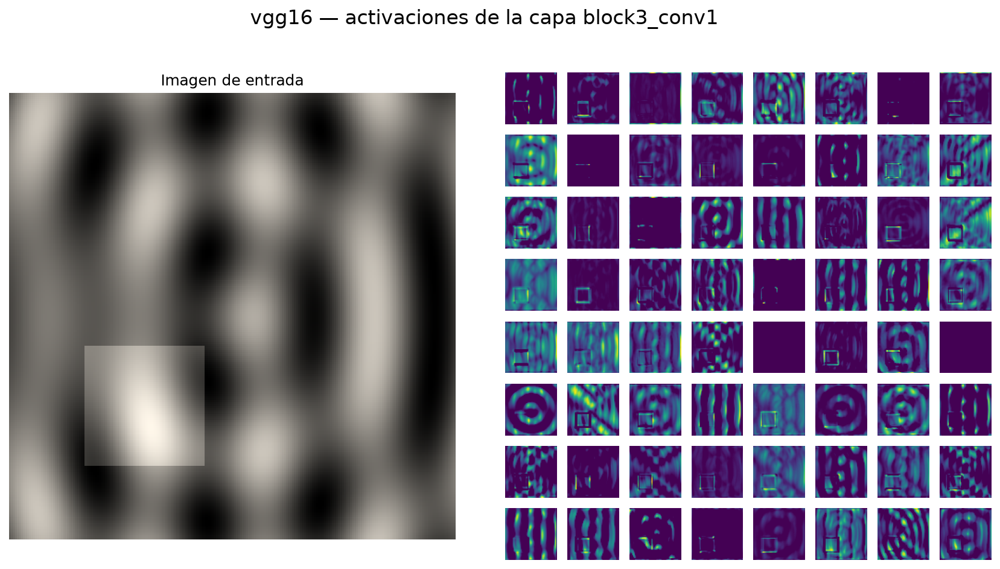

# TensorFlow Feature Visualization Toolbox — Documentation

This guide explains how to use and extend the feature visualization toolbox for TensorFlow/Keras neural networks.

**Languages:** [English](README.en.md) · [Español](README.md)

## Table of contents

1. [Introduction](#introduction)
2. [Installation](#installation)
3. [Basic usage](#basic-usage)
4. [Core components](#core-components)
5. [Custom models](#custom-models)
6. [Visualization techniques](#visualization-techniques)
7. [API reference](#api-reference)
8. [Troubleshooting](#troubleshooting)

## Introduction

TensorFlow Feature Visualization Toolbox is an interactive tool for understanding how convolutional neural networks work internally. It lets you watch in real time how each layer processes an image, what patterns each filter detects, and which image regions support a prediction.

### Why visualize neural networks?

Deep networks often behave like black boxes. Visualizing their features helps you:

- **Understand what each layer learns**: early layers detect edges and textures; deeper layers detect increasingly specific patterns.
- **Diagnose problems**: find dead or over-specialized filters.
- **Improve architectures**: inform design decisions with evidence.
- **Explain predictions**: show what the model focuses on when classifying.

## Installation

### Prerequisites

- Python 3.10 or newer
- TensorFlow 2.16 or newer (includes Keras 3)
- PyQt6 for the graphical interface

> **Version note.** Starting with TensorFlow 2.16, `tf.keras` is Keras 3, which removed attributes such as `layer.output_shape` and `layer.batch_input_shape`. This toolbox uses Keras 3 APIs and is not compatible with Keras 2.

### Install steps

```bash
git clone https://github.com/Sastiazaran/DeepVisualizationToolbox.git
cd DeepVisualizationToolbox

python -m venv .venv
source .venv/bin/activate

pip install -e .          # or pip install -e ".[dev]" for development
```

On Linux, PyQt6 needs a few system libraries:

```bash
sudo apt-get install libegl1 libgl1 libxkbcommon-x11-0 libdbus-1-3 libxcb-cursor0
```

## Basic usage

### Run the application

```bash
tf-feature-vis
```

This starts the app with VGG16 and the webcam. If no camera is available, the input source automatically falls back to synthetic images.

### Command-line options

```bash
tf-feature-vis --model resnet50 --input-source directory:./my_images --gpu
```

| Argument | Description |
| --- | --- |
| `--model` | Registry model (default: `vgg16`) |
| `--model-file` | Path to a saved model (`.keras`, `.h5`, or SavedModel) |
| `--weights` | `imagenet`, `none`, or a path to weights |
| `--no-top` | Exclude classification layers |
| `--input-source` | `webcam[:id]`, `file:<path>`, `directory:<path>`, `dataset:<cifar10\|mnist>`, or `synthetic` |
| `--input-size` | `WIDTH HEIGHT`; defaults to the model's native size |
| `--gpu` | Use the GPU for computation |
| `--output-dir` | Directory where saved visualizations are written |
| `--list-models` | List available models and exit |

### Navigating the interface

1. **Left panel**
   - Unprocessed input image
   - Top three predicted classes
   - Layer, filter, and visualization mode controls

2. **Right panel**
   - *Activations*: grid of the first 64 filters in the layer
   - *Filters*: saliency or guided backprop for the selected filter
   - *Optimization*: image generated by gradient ascent
   - *Grad-CAM*: heatmap for the predicted class overlaid on the image

Clicking a cell in the activation grid selects that filter.

### Keyboard shortcuts

| Key | Action |
| --- | --- |
| `←` / `→` | Previous / next image |
| `↑` / `↓` | Previous / next filter |
| `S` | Save the current view to `--output-dir` |
| `H` | Show help |
| `Esc` | Quit |

## Core components

### ModelWrapper

`ModelWrapper` wraps a Keras model and exposes visualization operations. Activation extractors are built on demand and cached, so wrapping a large model is instant.

```python
import keras

from tf_vis import ModelWrapper

wrapper = ModelWrapper(keras.applications.VGG16())

# Introspection
wrapper.visualizable_layers()          # layers with 2D or 4D output
wrapper.get_layer_info('block3_conv1') # name, type, shape, units, params
wrapper.num_filters('block3_conv1')    # 256

# Activations and gradients
activations = wrapper.forward_pass(image, 'block3_conv1')['block3_conv1']
gradients = wrapper.compute_gradients(image, 'block3_conv1', filter_indices=0)
saliency = wrapper.saliency_map(image, 'block3_conv1', filter_indices=0)
guided = wrapper.guided_backprop(image, 'block3_conv1', filter_indices=0)
```

### InputFetcher

`InputFetcher` loads images from different sources and preprocesses them for the model. It returns the preprocessed image and keeps the original in `current_raw_image`, so you can display it without the offsets introduced by preprocessing.

```python
from tf_vis import InputFetcher

with InputFetcher(input_source='directory:./images',
                  preprocessing_function=preprocess,
                  target_size=(224, 224)) as fetcher:
    image = fetcher.get_next_image()      # preprocessed
    original = fetcher.current_raw_image  # RGB uint8
```

Target size is specified as `(width, height)`, same as in OpenCV.

### Visualization

The `tf_vis.visualization` module contains techniques that do not depend on the GUI:

```python
from tf_vis.visualization import (
    apply_gradient_ascent,
    create_class_activation_map,
    display_activation_grid,
    overlay_heatmap,
    visualize_layer_filters,
    visualize_max_activations,
)

optimized = apply_gradient_ascent(wrapper, 'block3_conv1', filter_index=0)
cam = create_class_activation_map(wrapper, image, 'block5_conv3', class_idx=242)
heatmap = overlay_heatmap(original, cam)
```

## Custom models

From the command line, use `--model-file`:

```bash
tf-feature-vis --model-file ./my_model.keras --input-source directory:./images
```

From Python, assemble the components manually:

```python
import sys

import keras
from PyQt6.QtWidgets import QApplication

from tf_vis import InputFetcher, ModelWrapper
from tf_vis.ui.main_window import MainWindow

model = keras.models.load_model('my_model.keras')

input_fetcher = InputFetcher(
    input_source='directory:./my_images',
    preprocessing_function=lambda img: img / 255.0,
    target_size=(224, 224),
)

app = QApplication(sys.argv)
window = MainWindow(ModelWrapper(model), input_fetcher)
sys.exit(app.exec())
```

Model requirements:

- It must be a built functional or sequential model; subclassed models that have never been called do not expose input tensors.
- Layers must have unique names.
- For gradient ascent at any resolution, load with `include_top=False`; with the classification head attached, input size is fixed.

## Visualization techniques

### Activations

Shows each filter's output for the current image. Reveals which parts of the image activate each detector.



*Generated with `python docs/generate_examples.py --model vgg16 --layer block3_conv1`. Some filters respond to the square edges; others to the stripe pattern.*

### Saliency maps

Gradient of the activation with respect to input pixels, taking the maximum absolute value across color channels (Simonyan et al., 2014). The 99th percentile is clipped so a single extreme pixel does not wash out the rest of the map.

### Guided backpropagation

A variant of Zeiler & Fergus deconvolution from Springenberg et al. (2015): at each ReLU, only positive gradients from positive activations are propagated backward. Produces much sharper visualizations than raw gradients.

Both ways of declaring ReLU in Keras are supported: via the `activation` argument (VGG, InceptionV3) and as a standalone `ReLU` layer (ResNet, MobileNet, EfficientNet).

### Feature optimization

Generates an image by gradient ascent that maximizes a filter's activation, revealing the pattern that filter looks for. Feature-map borders dominated by padding are cropped.

### Grad-CAM

Weights a convolutional layer's feature maps by the mean gradient of the target class (Selvaraju et al., 2017). Unlike the original CAM, it does not require a global average pooling layer followed by a single dense layer, so it works with any model in the registry.

## API reference

### `tf_vis.model_wrapper.ModelWrapper`

| Method | Description |
| --- | --- |
| `forward_pass(image, layer_name=None)` | Activations for one layer or all visualizable layers |
| `compute_gradients(image, layer_name, filter_indices=None)` | Gradient with respect to the input |
| `saliency_map(image, layer_name, filter_indices=None)` | 2D saliency map in [0, 1] |
| `guided_backprop(image, layer_name, filter_indices=None)` | Guided gradient |
| `deconv(image, layer_name, filter_indices=None)` | Guided gradient ready to display |
| `get_activation_model(layer_name)` | Cached sub-model that outputs the layer activation |
| `get_layer_info(layer_name=None)` | Name, type, shape, units, and parameters |
| `get_layer_shape(layer_name)` | Output shape, or `None` |
| `num_filters(layer_name)` | Filters or neurons in the layer |
| `is_spatial_layer(layer_name)` | Whether output is a spatial feature map |
| `visualizable_layers()` | Layers with 2D or 4D output |
| `clear_cache()` | Release cached sub-models |

### `tf_vis.input_fetcher.InputFetcher`

| Member | Description |
| --- | --- |
| `get_next_image()` | Next preprocessed image |
| `get_previous_image()` | Previous image |
| `get_current_image()` | Current image without advancing the index |
| `get_specific_image(index)` | Image by index |
| `current_raw_image` | Last unprocessed RGB image |
| `is_live` | Whether the source is an active webcam |
| `len(fetcher)` | Number of images (0 for live sources) |
| `close()` | Release the camera |

### `tf_vis.visualization`

| Function | Description |
| --- | --- |
| `display_activation_grid(activations, grid_size=None, padding=1)` | Grid from `[n_filters, height, width]` |
| `visualize_layer_filters(model, layer_name, grid_size=None)` | Grid of a layer's kernels |
| `apply_gradient_ascent(wrapper, layer_name, filter_index, ...)` | Image that maximizes a filter |
| `visualize_max_activations(wrapper, dataset, layer_name, ...)` | Images that most activate each filter |
| `create_class_activation_map(wrapper, img, layer_name, class_idx)` | Grad-CAM |
| `overlay_heatmap(img, heatmap, alpha=0.5, colormap=...)` | Heatmap overlay |
| `normalize_01(array)` | Scale to [0, 1] |
| `standardize_for_display(array, spread=0.25)` | Contrast normalization for gradients |
| `clip_outliers(array, percentile=99.0)` | Clip the upper tail |
| `resolve_ascent_size(wrapper, image_size)` | Valid size for gradient ascent |

### `tf_vis.utils.misc`

| Function | Description |
| --- | --- |
| `get_model_specs()` | Registry `name -> ModelSpec` |
| `get_model_spec(name)` | Specification for one model |
| `load_model(name, weights='imagenet', include_top=True)` | Load a registry model |
| `load_model_from_file(path)` | Load a model from disk |
| `get_preprocessing_function(name)` | Model preprocessing function |
| `predict_image(model, img, top_k=5, model_name=None)` | Top-k classes with labels |
| `get_imagenet_labels()` | 1000 labels in Keras order |
| `create_model_summary(model)` | Serializable model summary |
| `save_visualizations(visualizations, output_dir, prefix='')` | Save PNGs and return paths |

### `tf_vis.utils.layers`

| Function | Description |
| --- | --- |
| `layer_output_shape(layer)` | Output shape compatible with Keras 3 |
| `layer_num_units(layer)` | Filters or neurons in the layer |
| `is_spatial_shape(shape)` | Whether shape is `[batch, height, width, channels]` |
| `describe_layer(layer)` | Layer summary as a dictionary |

## Troubleshooting

### `AttributeError: 'Conv2D' object has no attribute 'output_shape'`

You are mixing Keras 2 code with Keras 3. Use `tf_vis.utils.layers.layer_output_shape`, which works on both versions.

### `ImportError: libEGL.so.1: cannot open shared object file`

Qt system libraries are missing. On Debian or Ubuntu:

```bash
sudo apt-get install libegl1 libgl1 libxkbcommon-x11-0 libdbus-1-3 libxcb-cursor0
```

To run without a display server, export `QT_QPA_PLATFORM=offscreen`.

### Webcam does not open

The app prints a warning and switches to synthetic images. To force another camera use `--input-source webcam:1`; to work with files use `--input-source directory:./images`.

### `The model expects NxN inputs`

Gradient ascent must generate an image at the model's input size. Models loaded with `include_top=True` fix that resolution; load with `--no-top` to use any size.

### Slow performance

- Use `--gpu` if you have a configured GPU.
- Reduce resolution with `--input-size`.
- Optimization and Grad-CAM modes are the most expensive; activations is the lightest.
- With `--model-file` on large models, the first iterations include graph compilation.

### Errors with custom models

- The model must be built and expose input tensors.
- Layers must have unique names.
- Provide a preprocessing function that matches how the model was trained.

## Getting help

1. Check [known issues](https://github.com/Sastiazaran/DeepVisualizationToolbox/issues).
2. Open a new issue with your Python and TensorFlow versions and the full traceback.
